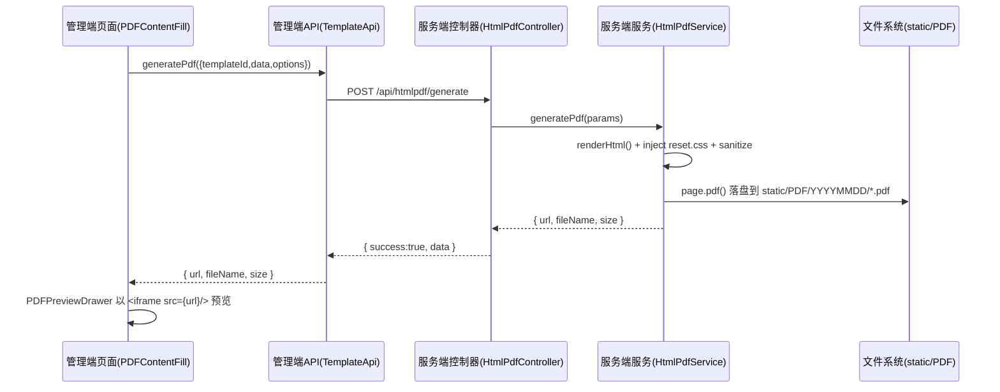

# PDF 功能全链路梳理（页面 -> 后台 -> 返回）

> 本文用于回归 Review，按“页面 -> 后台 -> 返回”的数据流顺序梳理管理端 PDF 相关功能，覆盖渲染 HTML 预览、生成 PDF、PDF 文件库三条主流程，列出关键代码文件，并给出测试清单、风险与优化建议、回滚方案。

## 一、涉及子系统与总体架构
- **管理端（management）**：React18 + Vite + Ant Design
  - 页面：`PDF 内容填充（生成）`、`PDF 文件库`
  - 组件：通用 PDF 预览抽屉
  - API 封装：`TemplateApi`
- **服务端（server）**：Node.js + Express + Inversify + Prisma
  - 控制器：`/api/htmlpdf/*`（HTML 预览 & PDF 生成 & 列表）、`/api/template/*`（模板管理）
  - 服务类：`HtmlPdfService`（核心渲染/生成逻辑）、`TemplateService`（模板 CRUD）
  - 静态资源：`/static` 暴露 `config.upload.uploadDir`，PDF 落盘到 `static/PDF/YYYYMMDD/*.pdf`

---

## 二、页面 -> 后台 -> 返回（三条主流程）

### 1) 预览 HTML（不落盘，仅渲染字符串）
- **页面（发起）**
  - 文件：`management/src/pages/PDFContentFill/index.tsx`
  - 方法：`handlePreviewHtml()`
  - 调用：`TemplateApi.renderHtml({ templateId, data, sanitize, previewHeaderFooter: true })`
- **API 封装（中间层）**
  - 文件：`management/src/api/template.ts`
  - 方法：`renderHtml(params)`
  - 请求：`POST /management-api/htmlpdf/render-html`（代理到服务端 `/api/htmlpdf/render-html`）
  - 响应：`text/html`（通过 `responseType: 'text'` 强制按文本处理）
- **服务端（处理）**
  - 控制器：`server/src/router/htmlpdf/controller.ts` → `renderHtml()`
  - 服务类：`server/src/router/htmlpdf/service.ts` → `renderHtml()`
    - 读取模板（Prisma）→ Handlebars 编译 → 注入 `reset.css` 与 UI 覆盖样式 → 预览模式追加“模板级头/尾” → 可选 `sanitize-html` 清洗
- **页面（返回-展示）**
  - 将返回的 HTML 放入 `<Modal><iframe srcDoc={html} /></Modal>` 进行预览（不写盘）

### 2) 生成 PDF（落盘 + 返回 URL）
- **页面（发起）**
  - 文件：`management/src/pages/PDFContentFill/index.tsx`
  - 方法：`handleGeneratePdf()` / `handleBatchGenerate()`
  - 调用：`TemplateApi.generatePdf({ templateId, data, sanitize, options })`
- **API 封装（中间层）**
  - 文件：`management/src/api/template.ts`
  - 方法：`generatePdf(params)`
  - 请求：`POST /management-api/htmlpdf/generate`（代理到 `/api/htmlpdf/generate`）
  - 响应：`{ url, fileName, size }`
- **服务端（处理）**
  - 控制器：`server/src/router/htmlpdf/controller.ts` → `generate()`
  - 服务类：`server/src/router/htmlpdf/service.ts` → `generatePdf()`
    - 复用 `renderHtml()` 生成安全 HTML
    - `puppeteer-core` 打开（或重用）浏览器 → `page.pdf({ path, format/width/height, margin, displayHeaderFooter, headerTemplate, footerTemplate })`
    - 目标路径：`static/PDF/<YYYYMMDD>/<fileName>.pdf`
    - 写入索引：`static/PDF/_index.json`（记录 url/fileName/size/dateKey/templateId/...）
    - 返回：`{ url, fileName, size }`
- **页面（返回-展示）**
  - 使用通用抽屉组件 `PDFPreviewDrawer` 以 `<iframe src={url} />` 打开 PDF

### 3) PDF 列表（文件库）
- **页面（发起）**
  - 文件：`management/src/pages/PDFLibrary/index.tsx`
  - 方法：`fetchData(page, pageSize)`（由 KTable 的 `fetchData` 触发）
  - 调用：`TemplateApi.listPdfs(templateId?)`
- **API 封装（中间层）**
  - 文件：`management/src/api/template.ts`
  - 方法：`listPdfs(templateId?)`
  - 请求：`POST /management-api/htmlpdf/list`（代理 `/api/htmlpdf/list`）
- **服务端（处理）**
  - 控制器：`server/src/router/htmlpdf/controller.ts` → `list()`
  - 服务类：`server/src/router/htmlpdf/service.ts` → `listPdfs()`
    - 合并 `static/PDF/_index.json` 与磁盘扫描结果，补全缺失项，并按时间倒序
- **页面（返回-展示）**
  - `KTable` 表格显示，点击“预览”调用 `PDFPreviewDrawer`

---

## 三、关键代码清单（按链路顺序）

- 管理端页面与组件
  - `management/src/pages/PDFContentFill/index.tsx`（PDF 内容填充与生成）
  - `management/src/pages/PDFLibrary/index.tsx`（PDF 文件库）
  - `management/src/components/PDFPreviewDrawer.tsx`（通用 PDF 预览抽屉）
- 管理端 API
  - `management/src/api/template.ts`（模板管理与 HTML/PDF 接口封装）
- 服务端控制器与服务
  - `server/src/router/htmlpdf/controller.ts`（`/api/htmlpdf/*`）
  - `server/src/router/htmlpdf/service.ts`（HTML 渲染、PDF 生成、列表索引逻辑）
  - `server/src/router/htmlpdf/types.ts`（接口 DTO 定义）
  - `server/src/router/template/controller.ts`（模板 CRUD：`/api/template/*`）
- 服务端基础设施
  - `server/src/config/container.config.ts`（DI 容器绑定 `HtmlPdfController`/`HtmlPdfService`、`Template*`）
  - `server/main.ts`（`/static` 静态目录暴露、`/temp` 暴露；清理任务；全局 `/api` 前缀）

---

## 四、时序图（生成 PDF 示例）

---

## 五、配置与依赖要点
- **puppeteer-core 可执行路径**：
  - 环境变量 `PUPPETEER_EXECUTABLE_PATH` 优先；否则 `HtmlPdfService.resolveExecutablePath()` 在多处常见路径中探测（Windows/Edge/Chrome、Linux、macOS）。
- **静态资源目录**：
  - 由 `AppConfig.upload.uploadDir` 指定根目录（默认 `static`），`server/main.ts` 通过 `app.use('/static', express.static(...))` 暴露。
- **PDF 目录结构**：
  - `static/PDF/<YYYYMMDD>/<fileName>.pdf`；索引文件 `static/PDF/_index.json` 用于列表快速展示与补全。

---

## 六、回归测试清单
- **[HTML 预览]** 选择模板 → 填写数据 → 点击“预览HTML” → 弹窗应显示完整 HTML（含头/尾与 reset 样式）。
- **[生成 PDF]** 选择模板 → 点击“生成PDF” → 返回 URL 可访问，抽屉可正常预览；磁盘存在对应 PDF；索引 `_index.json` 新增记录。
- **[批量生成]** 输入批量数量（1-100）→ 点击“批量生成” → 多个 PDF 生成且抽屉打开最新一个。
- **[文件库列表]** 打开“PDF 文件库” → 可按模板筛选、关键词过滤；点击“预览”抽屉正常。
- **[安全性]** 预览/生成 HTML 清洗：不应执行 `<script>`；图片 `data:`/http/https 允许。
- **[跨页打印]** 表格表头重复、行避免跨页断裂（`@media print` 覆盖）；头/尾与正文不重叠（安全缓冲）。

---

## 七、风险与优化
- **浏览器路径不可用**：`puppeteer-core` 在服务器缺少可执行浏览器时无法生成 PDF。
  - 方案：配置 `PUPPETEER_EXECUTABLE_PATH` 或安装 Chrome/Edge。
- **大体量 HTML 性能**：`page.setContent(..., networkidle0)` 对图片/外链较多时耗时。
  - 方案：模板中优先使用内联/本地资源；必要时调整 `waitUntil` 或资源超时。
- **索引文件一致性**：`_index.json` 与磁盘可能短暂不一致。
  - 方案：`listPdfs()` 已合并扫描补全；如需强一致，改为 DB 记录。

---

## 八、回滚方案
- 如本次改动引入问题：
  1. 前端可回退到先前提交前的 `TemplateApi`/`PDFContentFill`/`PDFLibrary` 版本（仅注释优化，不影响逻辑）。
  2. 服务端不涉及接口签名变化，若渲染异常，查看控制台 `puppeteer` 可执行路径日志与错误输出。

---

## 九、相关文件列表（带中文注释）
- 管理端
  - `management/src/pages/PDFContentFill/index.tsx`（已有详尽中文注释）
  - `management/src/pages/PDFLibrary/index.tsx`（已补充注释：调用链、分页策略、列含义、rowKey 与 fetchData 说明）
  - `management/src/components/PDFPreviewDrawer.tsx`（已含注释：iframe 预览说明）
  - `management/src/api/template.ts`（已含注释：接口路径、入参加返回结构）
- 服务端
  - `server/src/router/htmlpdf/controller.ts`（中文注释：接口、路径、返回）
  - `server/src/router/htmlpdf/service.ts`（大量中文注释：渲染/生成/列表/样式注入/边距联动/浏览器路径解析）
  - `server/src/router/htmlpdf/types.ts`（中文注释：DTO）
  - `server/src/router/template/controller.ts`（中文注释：模板 CRUD）
  - `server/src/config/container.config.ts`（中文注释：DI 绑定清单）
  - `server/main.ts`（中文注释：静态目录、清理任务、全局中间件）

---

## 十、结论
- PDF 功能链路清晰：页面 → API 封装 → 控制器 → 服务生成/写盘 → 返回 URL → 页面抽屉预览。
- 现已在关键代码处补充中文注释，便于回归 Review 与团队协作。
